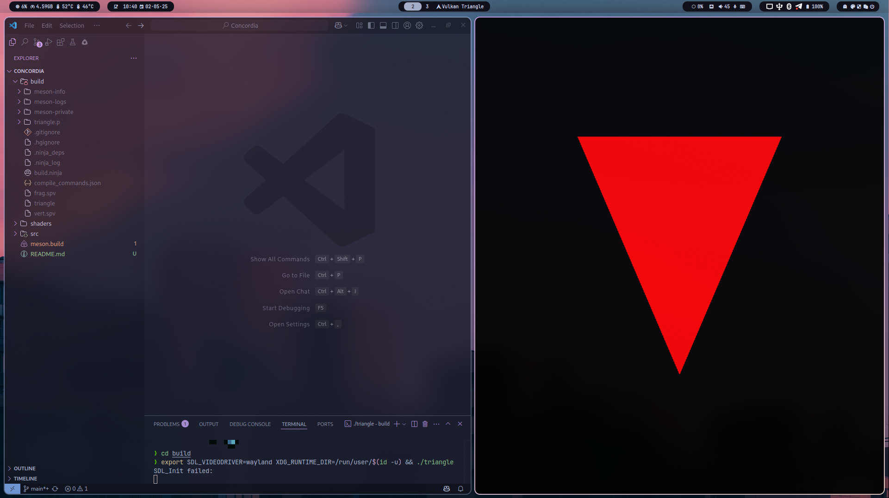

# 🔥 Concordia Dev-Log (Kinda Sorta)

## Dev‑Log: 02.05.25 – Vulkan + SDL3 Triangle (Cross‑Platform)

Today, I wrestled with Vulkan’s verbosity, SDL3’s Wayland quirks, and Meson’s shader pipeline until a red triangle finally winked at me on Linux/Wayland—and not just there, but on any platform with a Vulkan ICD and SDL3. Tried multiple “hello triangle” examples, Tizen’s SDL‑Vulkan guide, Windows setup tutorials, and community Q\&A on Reddit and StackOverflow when things went black. Now, I have a fully Meson‑powered build that compiles GLSL→SPIR‑V by default and runs on Linux (X11/Wayland). Maybe runs on Windows, and macOS (via MoltenVK) without code changes.

<small>🫃 So full... Yet, feed me more...</small>

### What Achieved

#### Cross‑Platform “Hello Triangle”

* **Unified codebase** using SDL3 for windowing and input, Vulkan for rendering, and Meson for builds—no GLFW, no platform‑specific `#ifdef`s.
* **Shader compilation** baked into Meson (`build_by_default: true`) so `vert.spv` and `frag.spv` appear in `build/` automatically.
* **Wayland support** via `SDL_VIDEODRIVER=wayland` + `XDG_RUNTIME_DIR` hints; validated against Hyprland and Tizen docs (Platform specific shit).
* **Device‑agnostic setup** following SDL‑Vulkan tutorials and Sascha Willems examples—works on Intel, AMD, NVIDIA, plus MoltenVK on macOS.

#### Pipeline Simplification

* Removed vertex‑buffer binding entirely; triangle generated in the vertex shader via `gl_VertexIndex`—zero “pull” setup in pipeline’s vertex‑input state.
* Consistent render‑pass + swapchain code reused from minimal Vulkan samples to guarantee at least a cleared background if triangle mis‑configured.

#### Troubleshooting & Validation

* Enabled `VK_LAYER_KHRONOS_validation` to catch missing `VK_KHR_surface` on instance vs. swapchain on device.
* Verified with `vulkaninfo` and Sascha Willems’ demos to isolate SDL3 mis‑linking vs. Vulkan ICD issues.

<small> I use Arch, btw.</small>

### 🫃 Next on My Course

#### 1. Vertex Buffers & Attributes

Add a real vertex buffer (with `VkVertexInputBindingDescription` / `VkVertexInputAttributeDescription`) so I can pass arbitrary geometry instead of hard‑coded `gl_VertexIndex` positions.

#### 2. Uniforms & Transformations

Introduce uniform buffers for model/view/projection matrices, leveraging descriptor sets and push constants to animate a rotating triangle in 3D space.

#### 3. C++20 Migration

Refactor to C++20: use `std::span` for buffer data, `std::filesystem` for file I/O, and coroutines for asynchronous resource loading.

#### 4. 3D Scene & Lighting

Build a mini‑scene with depth testing, basic Phong lighting, and multiple meshes. Encapsulate Vulkan setup in RAII classes.

#### 5. Engine Foundations for Concordia

* **Module design:** Renderer, resource manager, input system, scene graph.
* **Scripting interface:** Embed Lua or WASM for game logic.
* **Cross‑platform packaging:** Windows installer, Linux AppImage, macOS bundle with MoltenVK.

> “I’m so full… yea feed me more… Ohh, yeah.”

I've earned my rest; tomorrow I’ll feast on buffers, descriptors, and real‑time 3D. 🫃

