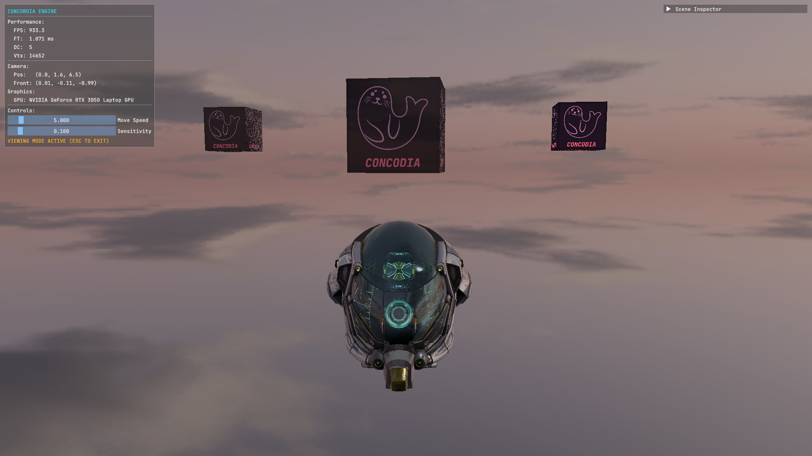

# 🔥 Concordia Dev-Log (Kinda Sorta)

## 📅 Dev‑Log Entry: 25.03.26 - The Great CMake & vk-bootstrap Migration

Today, the entire foundation underwent a massive seismic shift. Meson was ripped out, and raw Vulkan initialization was purged in favor of a modern, streamlined, and highly robust architecture. The triangle no longer just sits there squashed—it spins dynamically, aspect-corrected, and time-driven.

<small>🫃 Building the engine, one struct at a time...</small>

### What Achieved

#### 1. Pure CMake + Ninja Build System
* **No more shell scripts or Meson:** Transitioned completely to a `CMakeLists.txt` driven by `CMakePresets.json`.
* **One-command builds:** `cmake --build --preset run` gracefully handles configuring, building, shader compilation, and execution.
* **Hermetic submodules:** `SDL3` and `vk-bootstrap` are now statically linked right from `third_party/`, ensuring guaranteed cross-platform reproducibility without system package hunting.

#### 2. vk-bootstrap Refactoring
* Ripped out hundreds of lines of fragile Vulkan boilerplate.
* Replaced with `vkb::InstanceBuilder`, `vkb::PhysicalDeviceSelector`, `vkb::DeviceBuilder`, and `vkb::SwapchainBuilder`.
* The engine now handles API version bounds, validation layers, debug messengers, and optimal surface formats implicitly and safely.

#### 3. Zero-Stdlib (Almost) & High-Precision Timing
* Nuked `<fstream>`, `<chrono>`, and `<iostream>`.
* Replaced file loading with `SDL_LoadFile`, logging with `SDL_Log`, and timing with `SDL_GetPerformanceCounter`.
* Animation now uses double-precision time to prevent float drift over long sessions.

#### 4. Rock-Solid Swapchains & Wayland Fixes
* **Aspect-ratio correction:** Passed dynamically via Vulkan Push Constants so the triangle is no longer squashed.
* **HiDPI/Wayland correctness:** Replaced logical window dimensions with `SDL_GetWindowSizeInPixels()` during swapchain creation to prevent resolution mismatches on scaling compositors.
* **Safe Resizing:** Moved swapchain recreation out of the synchronous event loop and into the top of the `drawFrame` boundary using a deferred `needsResize` flag.

#### 5. The Latin Architecture (Phase 1 Complete)
* Extracted the monolithic `main.cpp` into a clean, modular namespace architecture.
* **`Petra::Window`**: Manages the SDL3 window, OS events, and Vulkan surface.
* **`Render::Context`**: Owns Vulkan initialization, queues, and swapchain recreation via `vk-bootstrap`.
* **`Vigil::Overlay`**: Encapsulates `imgui` integration across SDL3 and Vulkan backends.
* **`Nucleus::Engine`**: The irreducible center. Owns the render loop, pipeline, and sync primitives.
* `main.cpp` is now a 10-line file that just instantiates `Nucleus::Engine` and runs.

<small>The triangle spins, therefore I am.</small>

---

### 🫃 Next on My Course

#### 1. Vertex & Index Buffers (Memory & Form)
* Introduce `VulkanMemoryAllocator` (VMA) as a submodule.
* Start loading arbitrary geometry (vertices with positions and colors) using VMA-backed `VkBuffer`s.
* Abstract a `Mesh` structure to handle vertex inputs.

#### 3. 3D Math & Uniform Buffers
* Integrate `glm` for vector and matrix math.
* Implement a `Camera` class (View/Projection matrices).
* Pass the MVP (Model-View-Projection) data to the shaders via Uniform Buffers instead of just relying on Push Constants.

#### 4. Depth Buffering & 3D Rendering
* Introduce a depth attachment to the RenderPass.
* Migrate from a 2D rotating triangle to proper 3D cubes with perspective projection.

---

## 📅 Dev‑Log Entry: 25.03.26 (Night) - Dimensions & Textures

With the foundation solid, the engine expanded into the third dimension and underwent a serious dependency detox. The squashed triangle is officially dead; long live the spinning, depth-tested cube.

<small>📦 Allocating the future, one texel at a time...</small>

### What Achieved

#### 1. VMA & Resource Management (`Memoria`)
* **Submodule Integration:** Fully integrated `VulkanMemoryAllocator` (VMA).
* **Unified Allocation:** All buffers (Vertex, Index) and Images are now managed via `Memoria::Allocator`, providing stable GPU memory management with minimal overhead.

#### 2. 3D Engine Core (`Vista`, `Forma`)
* **Perspective Camera:** Implemented `Vista::Camera` to handle View and Projection matrices.
* **Depth Testing:** Added a depth buffer and configured the pipeline to handle occlusion, finally making 3D geometry look correct.
* **Mesh Abstraction:** `Forma::Mesh` now supports UV coordinates and includes a primitive generator for spinning cubes.

#### 3. stb_image Detox & Pathing
* **Purged SDL_image:** Ripped out the complex `SDL_image` dependency and replaced it with the lightweight, header-only `stb_image.h`.
* **Centralized Assets:** Reorganized the build system to output compiled SPIR-V shaders directly to `assets/shaders/compiled/`.
* **Robust Pathing:** Introduced the `CONCORDIA_ASSETS_DIR` compile-time macro, allowing the engine to reliably find textures and shaders regardless of the working directory.

#### 4. Modern Pipeline Integration (`Lumen`)
* Extended `Lumen::Pipeline` to support `VkDescriptorSetLayout`, enabling the wiring of combined image samplers.
* Synchronized descriptor set updates with the texture loading lifecycle.

<small>The cube spins in depth, though its colors remain a mystery for now.</small>

---

#### Texture Pipeline — Fixed (Three Root Causes)
* **Missing UVs in OBJ:** `cube.obj` had no `vt` entries at all. `fast_obj` silently returned `(0.0, 0.0)` for every vertex, making every face sample the same single grey texel. Added proper `vt` entries with per-face UV assignments.
* **Wrong image format:** Texture was declared as `VK_FORMAT_R8G8B8A8_UNORM` during debugging. PNG stores sRGB data — sampling linearly skips gamma correction, making everything look flat and desaturated. Restored `VK_FORMAT_R8G8B8A8_SRGB`.
* **Dark vertex tint:** Some cube vertices had colors as low as `{0.1, 0.1, 0.1}`. The shader computes `texture * vertexColor`, so dark vertices washed out entire faces. Set all to white `{1.0, 1.0, 1.0}`.

<small>The cube finally has a face. And it looks great.</small>

---

> 💡 **Future Me:** Try Slang for shaders — compiles to SPIR-V/HLSL/GLSL/Metal, designed for large shader codebases with modules and generics. Unreal 5.5 adopted it. Overkill now, relevant when shader count grows.

---

## 📅 Dev‑Log Entry: 25.03.26 (Late Night) - Skybox, PBR & The Material Mystery

The engine gains a sky. The engine gains physically-based materials. The engine gains a deep appreciation for how many ways a GLB file can silently give you wrong data.

<small>🌅 The sky is real. The materials are... getting there.</small>

### What Achieved

#### 1. Skybox Pipeline
* Implemented a dedicated skybox render pass in `Nucleus::Engine::drawFrame` — rendered before scene geometry with depth writes disabled.
* Added `skybox_vert.glsl` / `skybox_frag.glsl` to `Lumen::ShaderRegistry` as a named pipeline.
* HDR equirectangular loading via `stbi_loadf` extended into `Memoria::AssetManager`.
* Equirectangular → Cubemap conversion handled offline via `cmft`; baked cubemap shipped as an engine asset.

#### 2. Ambient IBL — Working
* Diffuse irradiance map precomputed offline and sampled as the ambient lighting term.
* The scene now responds to environment color — no more flat uniform ambient.
* Skybox and irradiance map share the same HDR source, processed into separate cubemap assets.

#### 3. PBR Foundation (`Lumen`, Shaders)
* Replaced Blinn-Phong with Cook-Torrance BRDF in `frag.glsl`.
  * **D:** Trowbridge-Reitz GGX normal distribution.
  * **G:** Smith's method with Schlick-GGX geometry term.
  * **F:** Schlick's Fresnel approximation.
* Push constants extended to 128 bytes — MVP matrices and material properties (`baseColor`, `roughness`, `metallic`) in a single call.
* `blinn_phong` pipeline retained in `Lumen::ShaderRegistry` for comparison and fallback.

#### 4. GLB Material Loading — In Progress 🟡
* `cgltf` integrated for GLTF 2.0 / GLB loading in `Forma::Mesh`.
* Base color texture extraction working correctly.
* **Known issue:** Roughness and metallic channels falling back to white — `cgltf_material` values appear correct on extraction but are not reaching the shader correctly. Root cause not yet isolated — likely a descriptor binding slot mismatch or push constant packing error.

<small>The sky is beautiful. The cube is confused about what it's made of.</small>

---

### 🫃 Next Session

#### 1. HDRI Upgrade
* Source higher quality HDRIs from [Poly Haven](https://polyhaven.com/hdris) (CC0).
* Good candidates: `autumn_field`, `kloofendal_48d_partly_cloudy`, `venice_sunset`.
* Rebake cubemap + irradiance map via `cmft` for each new HDRI.
* A gold cube (`metallic=1.0, roughness=0.0`) under a quality outdoor HDRI is the screenshot milestone.

#### 2. Full PBR Texture Stack (Phase 6.5 Foundation)
* `Forma::Material` is missing several slots that GLB provides — wire them up while `cgltf` is already integrated:
  * **Normal map** (`binding=1`) — required for correct BRDF on complex geometry, face normals alone look flat.
  * **Metallic/Roughness map** (`binding=2`) — G channel = roughness, B channel = metallic. Separate from albedo.
  * **Ambient Occlusion map** (`binding=3`) — multiply against diffuse term.
  * **Emissive map** (`binding=4`) — additive on top of lighting result.
* Update `Lumen::Pipeline` descriptor set layout to accommodate all five bindings.
* Update `assets/shaders/frag.glsl` to sample each slot with correct fallback values when unbound (white for albedo/AO, `vec2(0.5, 0.0)` for metallic/roughness, black for emissive).

#### 3. Texture Inspector in `Vigil`
* Dropdown per material slot: Albedo, Normal, Metallic/Roughness, AO, Emissive.
* `ImGui::Image()` thumbnail for each bound texture — will make the PBR channel bug immediately visible without log diving.
* Show raw scalar values (`roughness`, `metallic`, `baseColor`) alongside texture thumbnails.
* "No texture" placeholder when a slot is unbound — grey checkerboard.

#### 4. Vigil Debug Additions
* **GBuffer / channel visualizer** — toggle to isolate albedo, normals, metallic, roughness, depth individually. Essential for diagnosing any remaining PBR issues after the fix.
* **Normal visualizer** — render normals as RGB colors directly, immediately catches broken normal map imports from GLB.
* **IBL contribution toggle** — switch between ambient only, diffuse IBL only, specular IBL only, and combined. Isolates lighting bugs fast.
* **Light controls panel** — direction, color, and intensity sliders for the directional light. Currently requires a recompile to adjust.
* **Frame time graph** — scrolling `ImGui::PlotLines` of the last 128 frames. Establish a performance baseline before Phase 7 ECS changes the entity model.
* **Console/log panel** — redirect `SDL_Log` output into a scrollable Vigil window with color-coded severity. `BigBlueTerm` font for this panel specifically.

---

## 📅 Dev-Log Entry: 26.03.26 - PBR Actually Works (No Really This Time)
 
The material system is no longer gaslighting me. GLTF PBR is now functionally correct, and the engine finally renders assets that look like they belong.
 
<small>It was not Vulkan. It was never Vulkan.</small>
 
### What Achieved
 
#### 1. GLTF PBR - FIXED 
* **Root cause:** Tangent data mismatch + missing handedness (`w`) component.
* GLTF provides tangents as **vec4 (xyz + handedness)**, but the engine was:
  * Uploading only **vec3**
  * Losing the **bitangent sign**
* Shader expected `fragTangent.w` → got garbage → **broken TBN matrix → lighting artifacts / black shading**
 

 
> 💡 **Future Me:** Check out JoltPhysics when you're ready.
 
> 💡 **Future Me:** Check out [cmrc](https://github.com/vector-of-bool/cmrc) for embedding assets in the engine executable (like Godot).
 
---
 
## 📅 Dev‑Log Entry: 26.05.26 - The Purge & Debugging
 
The engine continues to evolve, moving towards a stricter, more modern asset pipeline and providing the tools needed to stop guessing what's happening in the fragment shader.
 
### What Achieved
 
#### 1. Render Debugging Tools (`Vigil`)
* Integrated a "Debug View" selector into the Scene Inspector.
* Enabled real-time visualization of PBR channels: **Metallic**, **Roughness**, **Normals**, and **Vertex Color**.
* Wired this through Push Constants to allow instant toggling without shader recompilation.
 
#### 2. The Great OBJ Purge
* Completely ripped out the legacy OBJ import pipeline.
* Deleted all `.obj` assets.
* **Standardization:** GLTF/GLB is now the exclusive geometric standard. OBJ is heresy.
 
#### 3. Engine Noise Reduction
* Purged per-frame `drawFrame` logs that were flooding the console.
* Refined GLTF normal loading and verification.

---

## 📅 Dev‑Log Entry: 26.05.26 - TOON Serialization & 3-Phase Scene Pipeline

The engine gains a data layer. Scene state is now serialized to TOON, survives shutdown, and resolves back into GPU-ready resources on load.

<small>📄 Data describes. Schema validates. The compiler enforces.</small>

### What Achieved

#### 1. TOON Integration (`Auxilia`)
* Added `ctoon` as a git submodule (`third_party/ctoon`) — C99 serializer/deserializer.
* Built a C++ RAII wrapper `Auxilia::toon_doc` with typed accessors, dot-path navigation, and file I/O.
* TOON is now the engine's scene IR, config format, and serialization layer.

#### 2. Scene Save/Load (`Mundus`)
* `Scene::save()` and `Scene::load()` produce/consume TOON files.
* Entity fields: stable `id`, `name`, name-based `parent`, `transform`, `meshSource`, `material`.
* Tagged type system: `@vec3(x,y,z)`, `@vec4(x,y,z,w)`, `@primitive(tag)`, `@asset(path)` — all plugin-level tagged strings, not core syntax.
* Strict parsing — no fallback, no backward-compat beyond explicit legacy handling.

#### 3. 3-Phase Pipeline (Load → Resolve → Upload)
* **Phase 1 (Load):** TOON produces data-only entity tree — no GPU work.
* **Phase 2 (Resolve):** `Engine::resolveSceneMeshes()` converts `meshSource` → mesh handles via `AssetManager::getMesh()`, and texture sources → `TextureAsset` via `resolveTexture()`.
* **Phase 3 (Upload):** `updateBindlessDescriptorSet()` syncs textures to GPU.
* Mesh/texture fields are references only until explicit resolve.

#### 4. Texture Round-Trip
* `Forma::Material` gained `albedoSource`, `normalSource`, etc. — texture paths saved to TOON and resolved on load.
* Embedded GLTF textures use stable `embedded_img_N` naming (image index, not pointer address) so cache keys survive reloads.
* `resolveTexture()` checks in-memory cache first, falls back to `loadTexture()` with asset-dir path resolution.

#### 5. Format Design Choices
* `@primitive(cube)` — flat tagged string, not nested `{primitive: cube}` object.
* `@asset(models/gltf/foo.glb)` — relative URI, no embedded quotes, no `\"` escaping issues, no absolute filesystem paths.
* Identity/default transform fields omitted on save (scale=1, pos/rot/angvel=0).
* Floats rounded to 6dp to prevent precision leakage (`0.35` not `0.3499999940395355`).

#### 6. Infrastructure
* Migrated build system from CMake to xmake.
* Editor tools: scene picking (`Mundus::pickEntity`), Blender-style keyboard shortcuts, entity inspector with debug channel visualization.
* Config driven by `assets/config/engine.toon` (window, camera, renderer).

---

## 📅 Dev‑Log Entry: 26.05.26 (Late) — TOON Takes Over Config

Every hardcoded value that had a reasonable home in a TOON file now lives there. Schema validation covers all config files. The engine loads its renderer state, UI layout, editor keybindings, and pipeline definitions from data, not source.

<small>📄 No more magic numbers. No more `#define` defaults. Just data.</small>

### What Achieved

#### 1. Schema Validation Framework (`Mundus::Schema`)
* Added `validateUI()`, `validateEditorKeys()`, `validateRenderPipelines()` — full field-type checking for every TOON config file.
* Schema enforcement is non-fatal: violations log warnings but don't block loading.
* `Vec2` type added alongside existing Vec3/4/Color/Quat/Asset/Entity/Primitive.

#### 2. Engine Config Extended (`engine.toon`)
* **Renderer:** `exposure`, `gamma`, `clear_color` (`@color`), `max_bindless_textures`, `depth_format`.
* **Scene:** `default_path` (asset URI), `auto_save` flag.
* **Lighting:** `default_direction` (`@vec3`), `default_color` (`@vec3`).
* **Skybox:** `default_scale` (`@vec3`).
* **Camera:** `default_position` (`@vec3`), `default_yaw`, `min_pitch`, `max_pitch` — camera init fully data-driven.
* Fallback defaults removed from C++ — engine uses `m_config.get_number(key, fallback)` only for safety.

#### 3. UI Config (`ui.toon`)
* Font loading (JetBrains Mono with Nerd Font icons), padding, rounding, scrollbar/grab sizes.
* Window layout: stats padding, inspector width, asset manager window size (`@vec2`), rename buffer size.
* Slider ranges for move speed and sensitivity in controls panel.
* Debug mode labels fetched from config (no more hardcoded `modes[]` array).
* Descriptor pool sizes (sets, samplers, combined image samplers) configurable.

#### 4. Editor Keys Config (`editor_keys.toon`)
* Camera movement keys (WASD, Space, LShift) and capture exit key.
* 8 action bindings: delete (DEL/X), toggle visibility (H), show all (Alt+H), toggle selection (A), focus camera (GRAVE), duplicate (Shift+D).
* `EditorKeyConfig` struct loaded once via `static` in `processEditorKeys()`.

#### 5. Render Pipeline Config (`render_pipelines.toon`)
* Three pipeline definitions: `pbr`, `skybox`, `skybox_hdri`.
* Each specifies: vertex/fragment shader paths (asset URIs), depth test/write state, compare op, cull mode, push constant size.
* `initPipeline()` parses VkCompareOp and VkCullModeFlags from string names.
* Falls back to hardcoded defaults if the TOON file is missing.

#### 6. Asset Manifest Extended (`assets.toon`)
* `skybox.scan_directories` — array of `{path, is_hdr}` entries replaces the hardcoded `"cubemap"` / `"hdri"` scan paths.
* `skybox.face_names[6]` — configurable face file names for individual cubemap loading.
* `default_material` — shader, base_color, roughness, metallic defaults.
* `scanSkyboxes()` and `loadCubemap()` use config-driven directories and face names.

#### 7. xmake `generate-defaults` Task
* Generates all 6 TOON files (`engine.toon`, `assets.toon`, `ui.toon`, `editor_keys.toon`, `render_pipelines.toon`, `default.scene`) if missing.

#### 8. Infrastructure
* `Camara::setPosition()`, `setYaw()`, `setPitchClamp()` added for data-driven initialization.
* `obj_str()`, `obj_num()`, `obj_bool()` helper wrappers for type-safe field extraction from raw ctoon nodes.
* `render_pipelines.toon` path resolution handles both `assets://` and `@asset(assets://)` formats.